# AlwaysPet API

API REST desenvolvida para gerenciamento e acompanhamento preventivo da saúde de pets, permitindo o cadastro de responsáveis, pets e alertas.

Projeto desenvolvido para o Challenge FIAP 2026.


# Integrante

- Felipe Wiclif Leal da Silva — RM 563901

Grupo:
- AlwaysPet


# Objetivo do Projeto

O AlwaysPet foi desenvolvido com o objetivo de auxiliar tutores no acompanhamento preventivo da saúde de seus pets, permitindo:

- cadastro de responsáveis;
- cadastro de pets;
- controle de informações básicas;
- alertas preventivos;
- consultas rápidas;
- gerenciamento centralizado.

A proposta do projeto é oferecer uma solução simples, organizada e escalável para clínicas veterinárias e tutores.


# Tecnologias Utilizadas

## Backend
- Java 17
- Spring Boot 3
- Spring Data JPA
- Hibernate
- Maven

## Banco de Dados
- H2 Database
- Oracle Mode

## Documentação
- Swagger / AlwaysPetAPI

## Ferramentas
- IntelliJ IDEA
- GitHub
- Postman


# Arquitetura do Projeto

O projeto foi estruturado seguindo o padrão em camadas:

```txt
src/main/java/br/com/alwayspet/api
│
├── controller
├── service
├── repository
├── dto
├── domain
├── exception
└── config
```
---

# Evidências do Projeto

## Estrutura do Projeto

A aplicação foi organizada seguindo arquitetura em camadas.

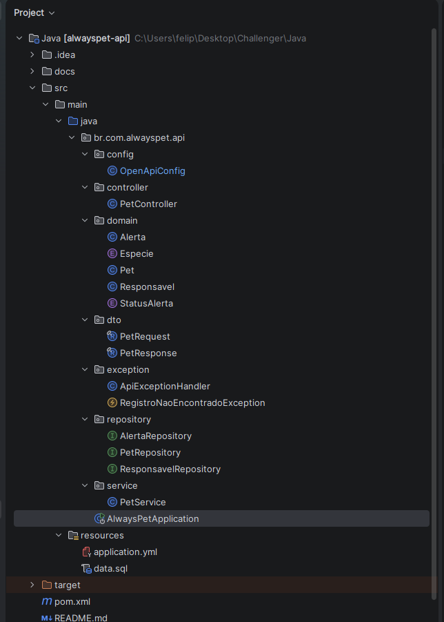


## Swagger / AlwaysPet API

Documentação da API utilizando Swagger/AlwaysPet API.

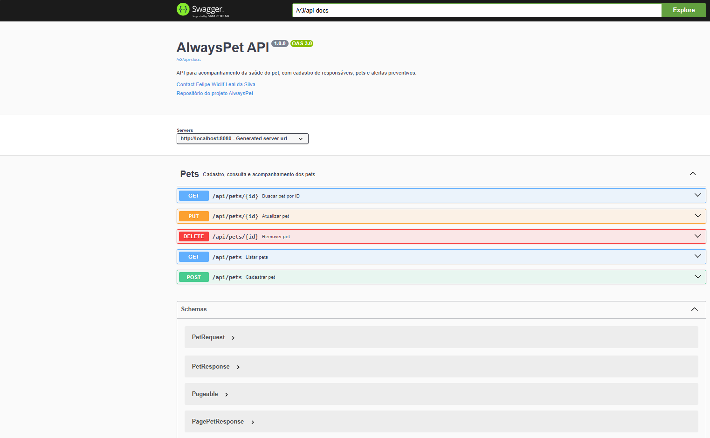


## Cadastro de Pet

Exemplo de cadastro de pet realizado pela API.

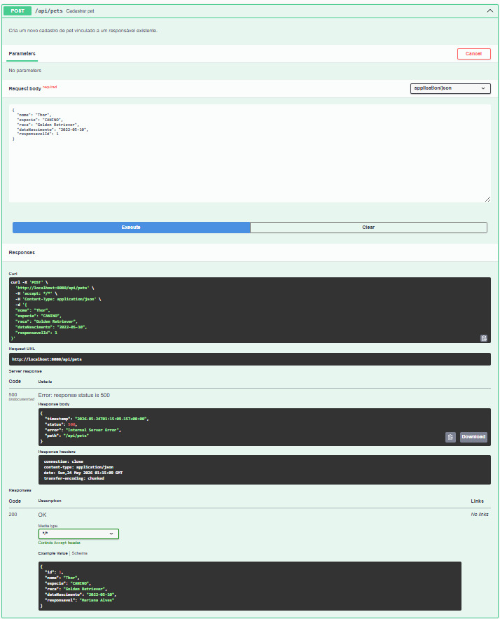


## Busca de Pet por ID

Consulta de pet utilizando endpoint GET.

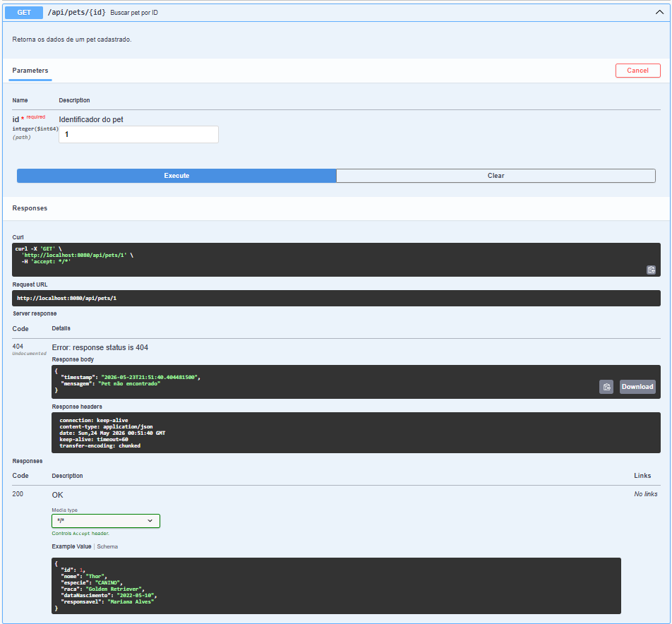


## Atualização de Pet

Atualização de dados do pet utilizando endpoint PUT.

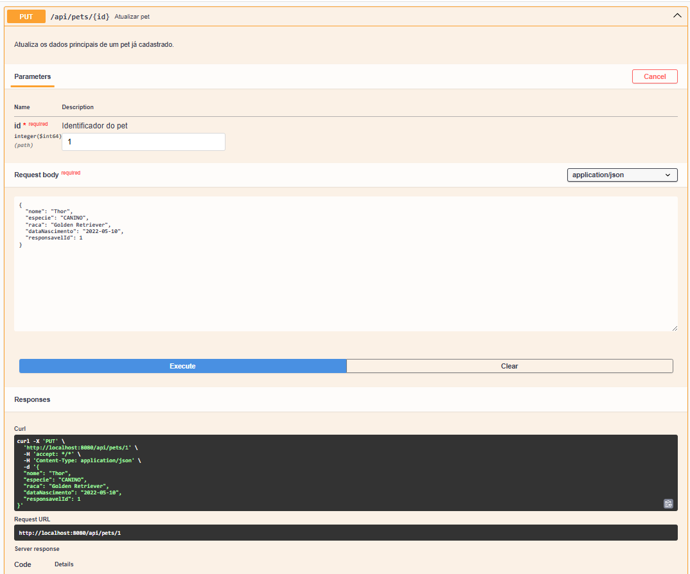
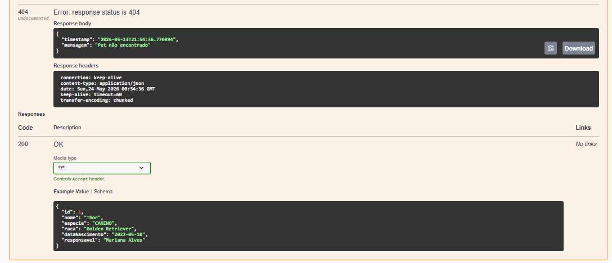


## Tratamento de Erros

Tratamento de exceções implementado para retorno padronizado da API.

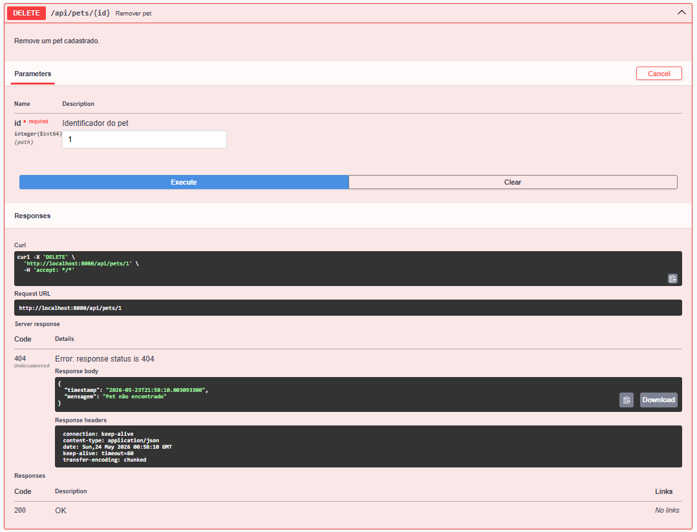


## Banco de Dados H2

Consulta realizada diretamente no banco H2 em memória.

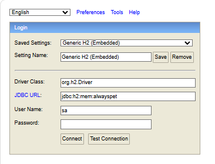
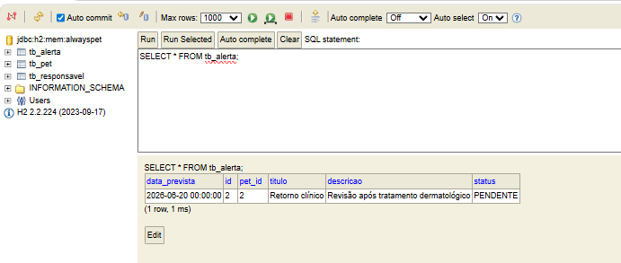
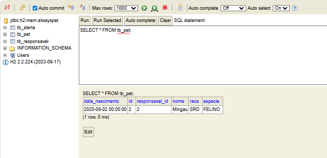
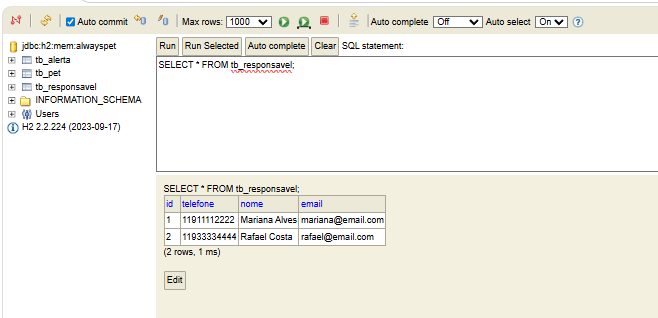


## Camadas

### Controller
Responsável pelos endpoints REST da aplicação.

### Service
Responsável pelas regras de negócio.

### Repository
Responsável pela comunicação com o banco de dados.

### DTO
Objetos utilizados para entrada e saída de dados da API.

### Domain
Entidades da aplicação.

### Exception
Tratamento global de exceções.

### Config
Configurações da aplicação e documentação Swagger.


# Funcionalidades

## Pets
- cadastrar pet;
- listar pets;
- buscar pet por ID;
- atualizar pet;
- remover pet.

## Responsáveis
- cadastro de responsáveis;
- vínculo entre responsável e pet.

## Alertas
- gerenciamento de alertas preventivos.


# Endpoints Principais

## Pets

### Listar pets

```http
GET /api/pets
```

### Buscar pet por ID

```http
GET /api/pets/{id}
```

### Cadastrar pet

```http
POST /api/pets
```

### Atualizar pet

```http
PUT /api/pets/{id}
```

### Remover pet

```http
DELETE /api/pets/{id}
```


# Exemplo de Cadastro

```json
{
  "nome": "Thor",
  "especie": "CANINO",
  "raca": "Golden Retriever",
  "dataNascimento": "2022-05-10",
  "responsavelId": 1
}
```


# Funcionalidades Implementadas

- CRUD completo;
- documentação Swagger;
- paginação;
- filtros;
- tratamento de exceções;
- validação de dados;
- cache;
- arquitetura em camadas;
- persistência com JPA/Hibernate.


# Tratamento de Erros

A aplicação possui tratamento global de exceções utilizando:

```java
@RestControllerAdvice
```

Exemplo de retorno:

```json
{
  "timestamp": "2026-05-24T00:00:00",
  "message": "Pet não encontrado"
}
```


# Banco de Dados

O projeto utiliza H2 Database em memória para desenvolvimento e testes.

## Acesso H2 Console

URL:

```txt
http://localhost:8080/h2-console
```

### Configuração

```txt
JDBC URL:
jdbc:h2:mem:alwayspet

User:
sa

Password:
(vazio)
```


# Swagger / OpenAPI

Documentação disponível em:

```txt
http://localhost:8080/swagger-ui.html
```

ou

```txt
http://localhost:8080/swagger-ui/index.html
```


# Como Executar o Projeto

## Pré-requisitos

- Java 17+
- Maven 3+
- IntelliJ IDEA (recomendado)


## Instalar dependências

```bash
mvn clean install
```


## Executar aplicação

```bash
mvn spring-boot:run
```


# Testes Realizados

Os seguintes testes foram executados com sucesso:

- GET;
- POST;
- PUT;
- DELETE;
- busca por ID;
- paginação;
- tratamento de erro 404;
- persistência no banco.


# Estrutura Utilizada no Desenvolvimento

O projeto foi desenvolvido utilizando boas práticas de desenvolvimento backend:

- separação em camadas;
- DTOs;
- JPA;
- tratamento de exceções;
- documentação OpenAPI;
- código organizado;
- padronização REST.


# Melhorias Futuras

- autenticação JWT;
- integração com clínicas veterinárias;
- envio de notificações;
- dashboard administrativo;
- integração mobile;
- histórico médico completo;
- upload de exames.


# Considerações Finais

O AlwaysPet foi desenvolvido com foco em organização, escalabilidade e boas práticas de desenvolvimento backend utilizando Spring Boot.
A aplicação entrega uma base sólida para evolução futura da plataforma, permitindo integração com aplicações mobile, dashboards administrativos e serviços externos.


## GITHUB

```text
https://github.com/Wiclif06/challenger-apialwayspet
```